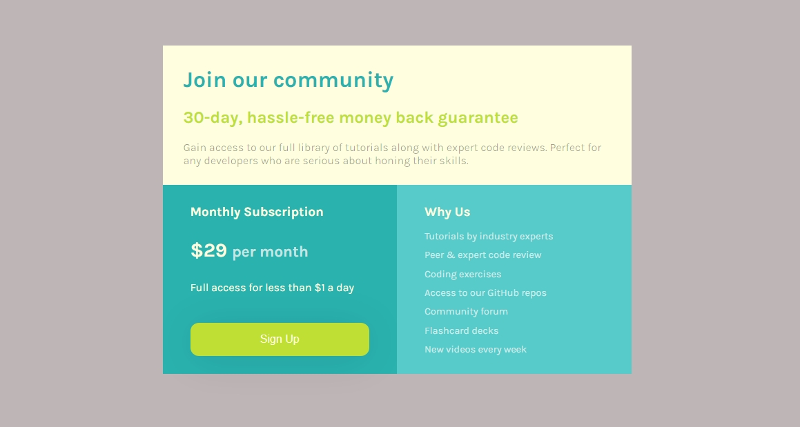
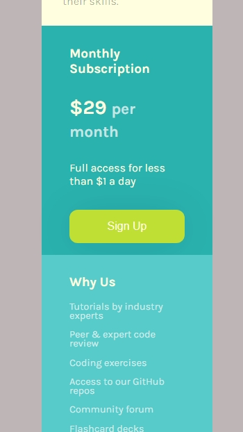

# Frontend Mentor - Single price grid component solution

This is a solution to the [Single price grid component challenge on Frontend Mentor](https://www.frontendmentor.io/challenges/single-price-grid-component-5ce41129d0ff452fec5abbbc). Frontend Mentor challenges help you improve your coding skills by building realistic projects. 

## Table of contents

- [Overview](#overview)
  - [The challenge](#the-challenge)
  - [Screenshot](#screenshot)
- [My process](#my-process)
  - [Built with](#built-with)
  - [What I learned](#what-i-learned)
  - [Continued development](#continued-development)
- [Author](#author)

## Overview
This is a single price grid component solution, a challenge i took on frontendmentor.
i oitlined evrything i did in the project, how i did it and what i enjoyed bout it, feel free to go through it and make your contributions.

### The challenge

Users should be able to:

- View the optimal layout for the component depending on their device's screen size
- See a hover state on desktop for the Sign Up call-to-action

### Screenshot




### Built with

- Semantic HTML5 markup
- CSS custom properties
- Imported Google Fonts
- CSS Grid
- Mobile-first workflow

### What I learned

In this challenge i learnt hw to properly use CSS grid to create reponsive designs and also how to import google fonts.

```html
    <link rel="preconnect" href="https://fonts.googleapis.com">
    <link rel="preconnect" href="https://fonts.gstatic.com" crossorigin>
    <link href="https://fonts.googleapis.com/css2?family=Karla:ital,wght@0,200..800;1,200..800&display=swap" rel="stylesheet">
```
```css
    .container {
        display: grid;
        grid-template-columns: 1fr 1fr; 
    }

    @media (max-width: 600px) {
        .container {
            grid-template-columns: 1fr; 
        }
    }
```

### Continued development

I will like to gain more knowledge and understanding of the grid system, while taking on more complex projects that will help me develop faster.

## Author

- Website - [Kelvin Ahante](https://kelvinahante.com)
- Frontend Mentor - [@kiviekelvin](https://www.frontendmentor.io/profile/kiviekelvin)
